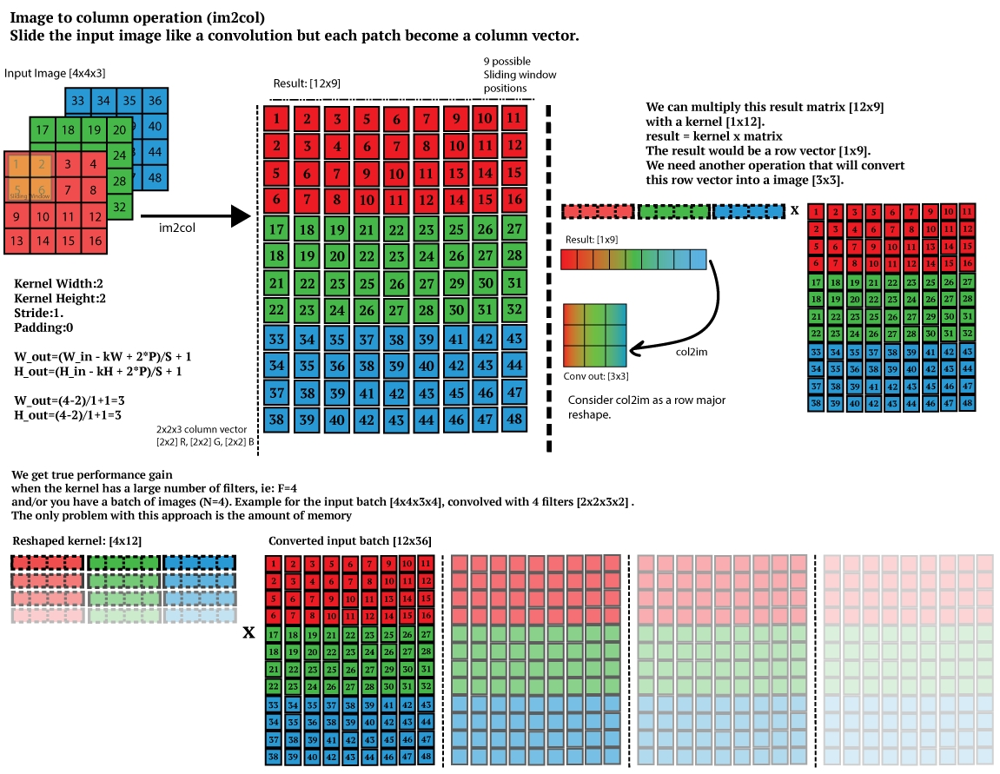

# Kernels-JGMA

## Kernels

- `Im2Col`: Image to column. The algorithm is based on [this](https://leonardoaraujosantos.gitbook.io/artificial-inteligence/machine_learning/deep_learning/convolution_layer/making_faster) explanation.


- `MatMul`: matrix multiplication.
- `MatMulTransp`: matrix multiplication with the second matrix transposed.
- `MatTransp`: matrix transpose.
- `Relu`: rectified linear unit.
- `VecMulAdd`: vector multiply add.

## Functions

### Constructor
Generates the data structures required for the kernel depending on the arguments. 

All kernels have a constructor function that requires an integer with the cache size the user wants to stress. The constructor generates the data structures according to this value.
```cpp
    Kernel* k = new Kernel(cache_size);
```
`Im2Col` has more constructor functions to tune the following algorithm parameters: input *image dimensions*, *kernel dimensions*, and the *stride*.

### Init
Initializes the data structures before running the kernel. This step is required before the first run.

### Run
Runs the kernel.

### InitAndRun
Initializes the data structures and runs the kernel.

### PrintInfo
Prints relevant information about the data structures and the kernel's result.

## How to use it
We exemplify the usage of the kernels with `MatMul` stressing a 4MB cache:
```cpp
#include "matmul.h"

int main () {
    Kernel* k = new MatMul(4*Kernel::megabyte);
    k->InitAndRun();
    k->PrintInfo();
}    
```
In case the user wants to run 1000 times the same kernel:
```cpp
#include "matmul.h"

int main() {
    Kernel* k = MatMul(4*Kernel::megabyte);
    k->Init();
    for (int i = 0; i < 1000; ++i) {
        k->Run();
    }
}
```

Look at *src/test.cc* for more examples. It is the file used to test all kernels. The user can compile it using the Makefile.
```bash
make        # for compiling
make clean  # for removing all elements created by the compilation (obj and bin folders)
```
The binary generated after the compilation is stored in *bin/test*, and the object files in *obj/*.
